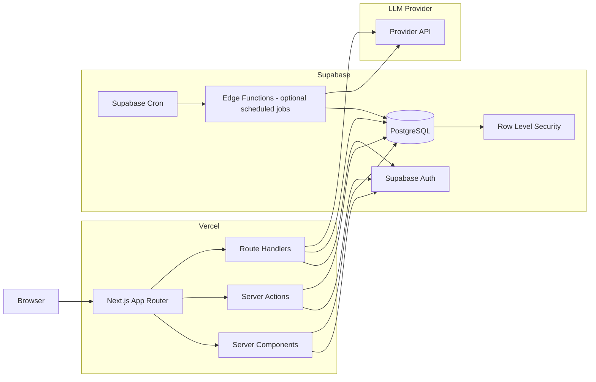
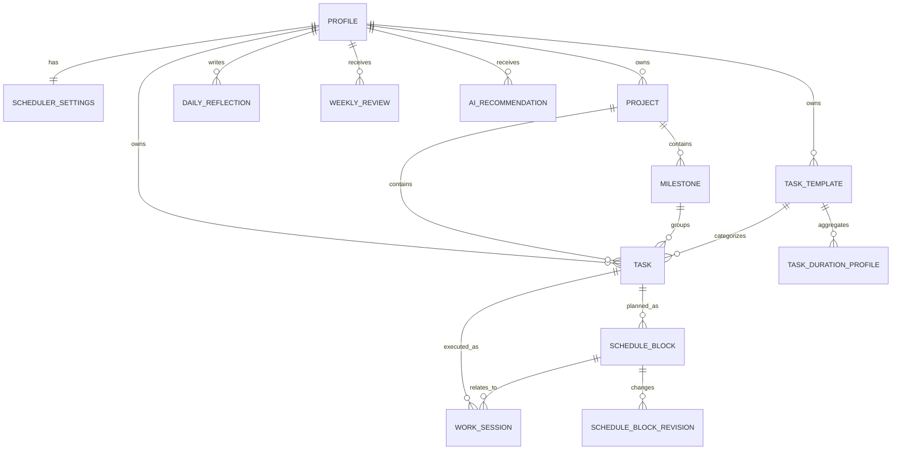

# Personal Work Scheduler
## Architecture & Implementation Specification

- **Document purpose:** Claude/Coding Agent implementation source of truth
- **Target stack:** Next.js + Vercel + Supabase
- **Primary language:** TypeScript
- **Document version:** 1.0
- **Date:** 2026-09-29
- **Default timezone:** `America/Toronto`

---

# 1. Product Overview

This project is a personal website with two major areas.

## 1.1 Public Area

Public pages are available without authentication.

- Portfolio
- Technical blog
- About / profile
- Project showcase

The public area is not the primary scope of this document. It must remain structurally separated from authenticated utilities.

## 1.2 Private Area

Private utilities require authentication.

Planned utilities include:

- Work Scheduler
- Personal Finance / Expense Tracker
- English Study
- Additional personal utilities

The first private utility to implement is **Work Scheduler**.

---

# 2. Product Goal

The Work Scheduler is not a simple Todo application.

Its purpose is to build a feedback loop based on the user's real work behavior.

```text
Task creation
    ↓
Calendar planning
    ↓
Actual work execution
    ↓
Actual time / focus / mood logging
    ↓
Plan vs Actual analysis
    ↓
Personal duration model update
    ↓
Better future time allocation
    ↓
Weekly AI feedback
    ↓
Improved next-week planning
```

The system should gradually learn:

- How long each kind of work actually takes the user
- Which work is consistently underestimated
- Which times of day are productive
- Which tasks are frequently rescheduled
- Which projects are falling behind milestones
- How much work the user can realistically complete per day/week

The main long-term asset is **the user's historical work data**, not the AI model.

---

# 3. Core Product Principles

## 3.1 Task is not a Calendar Event

These concepts MUST remain separate.

```text
Task
    ↓ 1:N
Schedule Block
    ↓ 0:N
Work Session
```

Example:

```text
Task
"Implement authentication"

Planned:
Monday    10:00 - 11:30
Tuesday   14:00 - 15:00

Actual:
Monday    10:15 - 11:10
Tuesday   14:20 - 15:45
Tuesday   20:00 - 20:30
```

A task can be split across several planned blocks and several actual work sessions.

Do NOT store `start_at` / `end_at` directly on `tasks`.

---

## 3.2 Plan and Actual Must Remain Independent

Planned work is stored in:

- `schedule_blocks`

Actual work is stored in:

- `work_sessions`

Do not overwrite the plan with actual timestamps.

This separation is required for:

- planning accuracy
- duration estimation
- rescheduling analysis
- AI feedback
- productivity trend analysis

---

## 3.3 Historical Data Is Source of Truth

AI must not invent work-duration estimates when enough user history exists.

Priority:

```text
1. Actual historical work sessions
2. User-entered estimate
3. Task template default
4. Generic fallback
```

---

## 3.4 AI Is Advisory

AI MUST NOT directly modify primary task/project/calendar data without explicit user action.

AI may automatically create:

- weekly review records
- generated recommendations

AI-generated task recommendations must first be stored in:

- `ai_recommendations`

Then the user can:

- Accept
- Modify
- Reject

Only an accepted recommendation becomes a real `task`.

---

## 3.5 Statistics Before AI

Deterministic calculations should not be delegated to an LLM.

Application/PostgreSQL should calculate:

- planned minutes
- actual minutes
- averages
- medians
- completion rate
- plan/actual ratios
- focus averages
- task counts
- work-hour distributions

The LLM should receive aggregated structured data and perform:

- explanation
- pattern interpretation
- feedback writing
- milestone breakdown suggestions
- next-action suggestions

---

# 4. Scope

## 4.1 MVP

The MVP must support:

1. Create today's tasks
2. Edit / delete tasks
3. Display a weekly time-grid calendar
4. Drag a task into a time slot
5. Automatically assign a recommended duration when dropped
6. Move scheduled blocks
7. Resize scheduled blocks
8. Record actual work sessions
9. Run one active timer at a time
10. Manually add actual work sessions
11. Record focus / mood / daily note
12. Compare planned time and actual time
13. Learn task-duration correction factors
14. Display project and milestone relationships
15. Generate weekly statistics
16. Generate an AI weekly review
17. Generate project/milestone-based task recommendations
18. Accept/reject AI recommendations

## 4.2 Explicit Non-Goals for MVP

Do NOT implement these during the initial version unless all MVP requirements are complete.

- Team collaboration
- Multi-user shared calendars
- Billing
- Push notifications
- Native mobile app
- Complex dependency graph / Gantt chart
- Automatic Google Calendar synchronization
- NLP-only task creation
- Vector database / embeddings
- Autonomous AI that edits schedules without approval
- Complex ML models
- Public social features

---

# 5. High-Level Architecture



---

# 6. Architecture Decisions

## 6.1 Next.js App Router

Use Next.js App Router.

Use:

- Server Components for initial page reads
- Client Components only for interactive UI
- Server Actions for authenticated UI mutations
- Route Handlers for HTTP endpoints, AI endpoints, external integrations, and internal jobs
- `proxy.ts` for Supabase session refresh / route-level optimistic redirects

Do not create a parallel Pages Router architecture.

---

## 6.2 Rendering Strategy

Default to Server Components.

Client Components should be limited to interactive features such as:

- Weekly calendar
- Drag and drop
- Timer
- Modal / Drawer state
- Inline editing
- Local optimistic interactions

Example:

```text
scheduler/page.tsx                 Server Component
    ↓
SchedulerWorkspace                Server Component
    ├─ TodayTaskPanel              Client Component
    ├─ WeeklyCalendar              Client Component
    └─ TaskDetailDrawer            Client Component
```

Do not mark an entire page `"use client"` only because one child component needs browser interaction.

---

## 6.3 Mutation Strategy

Use Server Actions for first-party UI mutations.

Examples:

- createTask
- updateTask
- deleteTask
- scheduleTask
- moveScheduleBlock
- resizeScheduleBlock
- startWorkSession
- stopWorkSession
- createDailyReflection
- acceptAiRecommendation

Each action MUST:

1. validate input with Zod
2. verify authenticated user
3. call domain/service layer
4. rely on RLS as the database boundary
5. return typed success/error results
6. invalidate/revalidate relevant UI data if necessary

Do not put raw database mutation logic inside React components.

---

## 6.4 Route Handlers

Use Route Handlers for:

```text
/api/ai/weekly-review
/api/ai/daily-recommendations
/api/internal/jobs/weekly-review
/api/internal/jobs/daily-planner
/api/integrations/*
```

Do not duplicate the same business mutation as both a Server Action and Route Handler unless an external API consumer genuinely requires it.

---

## 6.5 Supabase Authentication

Use:

- `@supabase/supabase-js`
- `@supabase/ssr`
- cookie-based authentication
- browser/server Supabase clients
- `proxy.ts` for session refresh

Required utilities:

```text
src/lib/supabase/
├── client.ts
├── server.ts
└── proxy.ts
```

Authorization MUST NOT rely only on route redirects.

Database Row Level Security is mandatory.

---

# 7. Repository Structure

Use one repository and one Next.js application.

```text
/
├── src/
│   ├── app/
│   │   ├── (public)/
│   │   │   ├── layout.tsx
│   │   │   ├── page.tsx
│   │   │   ├── portfolio/
│   │   │   │   └── page.tsx
│   │   │   └── blog/
│   │   │       ├── page.tsx
│   │   │       └── [slug]/
│   │   │           └── page.tsx
│   │   │
│   │   ├── (auth)/
│   │   │   ├── login/
│   │   │   │   └── page.tsx
│   │   │   └── auth/
│   │   │       └── callback/
│   │   │           └── route.ts
│   │   │
│   │   ├── (private)/
│   │   │   ├── layout.tsx
│   │   │   ├── dashboard/
│   │   │   │   └── page.tsx
│   │   │   ├── scheduler/
│   │   │   │   ├── page.tsx
│   │   │   │   ├── projects/
│   │   │   │   │   └── page.tsx
│   │   │   │   ├── history/
│   │   │   │   │   └── page.tsx
│   │   │   │   └── review/
│   │   │   │       └── page.tsx
│   │   │   ├── finance/
│   │   │   │   └── page.tsx
│   │   │   └── english/
│   │   │       └── page.tsx
│   │   │
│   │   └── api/
│   │       ├── ai/
│   │       │   ├── weekly-review/
│   │       │   │   └── route.ts
│   │       │   └── daily-recommendations/
│   │       │       └── route.ts
│   │       └── internal/
│   │           └── jobs/
│   │               ├── weekly-review/
│   │               │   └── route.ts
│   │               └── daily-planner/
│   │                   └── route.ts
│   │
│   ├── features/
│   │   ├── scheduler/
│   │   │   ├── components/
│   │   │   │   ├── scheduler-workspace.tsx
│   │   │   │   ├── today-task-panel.tsx
│   │   │   │   ├── weekly-calendar.tsx
│   │   │   │   ├── calendar-block.tsx
│   │   │   │   ├── task-list-item.tsx
│   │   │   │   ├── task-detail-drawer.tsx
│   │   │   │   ├── work-session-timer.tsx
│   │   │   │   └── daily-reflection-dialog.tsx
│   │   │   │
│   │   │   ├── actions/
│   │   │   │   ├── task.actions.ts
│   │   │   │   ├── schedule.actions.ts
│   │   │   │   ├── work-session.actions.ts
│   │   │   │   └── reflection.actions.ts
│   │   │   │
│   │   │   ├── queries/
│   │   │   │   ├── task.queries.ts
│   │   │   │   ├── schedule.queries.ts
│   │   │   │   ├── session.queries.ts
│   │   │   │   └── analytics.queries.ts
│   │   │   │
│   │   │   ├── services/
│   │   │   │   ├── task.service.ts
│   │   │   │   ├── scheduling.service.ts
│   │   │   │   ├── duration-estimator.service.ts
│   │   │   │   └── analytics.service.ts
│   │   │   │
│   │   │   ├── schemas/
│   │   │   │   ├── task.schema.ts
│   │   │   │   ├── schedule.schema.ts
│   │   │   │   ├── work-session.schema.ts
│   │   │   │   └── reflection.schema.ts
│   │   │   │
│   │   │   ├── domain/
│   │   │   │   ├── task.types.ts
│   │   │   │   ├── schedule.types.ts
│   │   │   │   └── scheduler.constants.ts
│   │   │   │
│   │   │   └── utils/
│   │   │       ├── duration.ts
│   │   │       ├── calendar.ts
│   │   │       └── timezone.ts
│   │   │
│   │   ├── projects/
│   │   │   ├── components/
│   │   │   ├── actions/
│   │   │   ├── queries/
│   │   │   ├── services/
│   │   │   └── schemas/
│   │   │
│   │   └── ai/
│   │       ├── services/
│   │       │   ├── provider.ts
│   │       │   ├── weekly-review.service.ts
│   │       │   └── task-recommendation.service.ts
│   │       ├── schemas/
│   │       │   ├── weekly-review.schema.ts
│   │       │   └── recommendation.schema.ts
│   │       └── prompts/
│   │           ├── weekly-review.prompt.ts
│   │           └── project-planner.prompt.ts
│   │
│   ├── components/
│   │   ├── ui/
│   │   ├── layout/
│   │   └── shared/
│   │
│   ├── lib/
│   │   ├── supabase/
│   │   │   ├── client.ts
│   │   │   ├── server.ts
│   │   │   └── proxy.ts
│   │   ├── env.ts
│   │   ├── logger.ts
│   │   └── errors.ts
│   │
│   └── styles/
│       └── globals.css
│
├── supabase/
│   ├── migrations/
│   ├── functions/
│   │   ├── daily-planner/
│   │   └── weekly-review/
│   ├── tests/
│   │   └── rls/
│   ├── seed.sql
│   └── config.toml
│
├── tests/
│   ├── unit/
│   ├── integration/
│   └── e2e/
│
├── docs/
│   ├── architecture.md
│   ├── schema.md
│   ├── ai-contracts.md
│   └── decisions/
│
├── proxy.ts
├── next.config.ts
├── package.json
├── tsconfig.json
└── README.md
```

---

# 8. Repository Rules

## 8.1 Feature-First Organization

Business logic belongs under:

```text
src/features/<feature>
```

Shared primitive UI belongs under:

```text
src/components/ui
```

Infrastructure belongs under:

```text
src/lib
```

Do not create a large generic `utils/` folder containing unrelated domain logic.

---

## 8.2 Dependency Direction

Allowed:

```text
app
 ↓
feature components
 ↓
actions / services / queries
 ↓
lib / Supabase
```

Not allowed:

```text
database code → React component
service → page component
domain service → browser-only code
```

---

# 9. Technology Choices

Recommended baseline:

| Concern | Technology |
|---|---|
| Framework | Next.js App Router |
| Language | TypeScript strict mode |
| Deployment | Vercel |
| Database | Supabase PostgreSQL |
| Authentication | Supabase Auth |
| Authorization | PostgreSQL RLS |
| Styling | Tailwind CSS |
| UI primitives | shadcn/ui or equivalent lightweight primitives |
| Calendar | FullCalendar React |
| Validation | Zod |
| Date utilities | date-fns / date-fns-tz |
| Unit tests | Vitest |
| Component tests | React Testing Library |
| E2E | Playwright |
| AI | Provider abstraction; do not couple domain logic to one vendor |

Pin exact dependency versions in `package.json`.

Avoid unbounded `"latest"` dependencies after initial project scaffolding.

---

# 10. Route Design

## Public

```text
/
 /portfolio
 /blog
 /blog/[slug]
```

## Authentication

```text
/login
/auth/callback
```

## Private

```text
/dashboard

/scheduler
/scheduler/projects
/scheduler/history
/scheduler/review

/finance
/english
```

The scheduler root page is the primary daily working screen.

---

# 11. Main Scheduler UX

Desktop-first layout:

```text
┌────────────────────────────────────────────────────────────────────┐
│ Header / Date / Week Navigation / Active Timer                    │
├───────────────────┬────────────────────────────────────────────────┤
│ TODAY TASKS       │ WEEK CALENDAR                                  │
│                   │                                                │
│ □ Task A          │ MON   TUE   WED   THU   FRI   SAT   SUN       │
│ □ Task B          │                                                │
│ □ Task C          │      ┌───────────────┐                         │
│                   │      │ Task A        │                         │
│ + Add task        │      │ 09:00 - 10:30 │                         │
│                   │      └───────────────┘                         │
│                   │                                                │
├───────────────────┴────────────────────────────────────────────────┤
│ Planned 5h 30m | Actual 4h 15m | Focus 4.0 | Completed 6 / 8     │
└────────────────────────────────────────────────────────────────────┘
```

Optional task details open in a right-side drawer rather than navigating away.

---

# 12. Calendar Interaction Rules

Use a weekly vertical time-grid.

Primary interactions:

- drag task from Today list → calendar
- drag scheduled block → different time
- resize scheduled block
- click empty range → create task/block
- click block → open task details
- start work timer from block/task
- mark task complete
- mark block skipped

When a task is dropped onto the calendar:

```text
1. Read task.user_estimated_minutes
2. Resolve learned recommendation
3. Determine recommended duration
4. Create schedule_block
5. Render the block with recommended length
```

Example:

```text
User estimate:        60 min
Historical factor:    1.35
Recommended duration: 80 min
Drop time:            10:00

Created block:
10:00 - 11:20
```

Round durations to the scheduler slot increment.

Default slot increment:

```text
15 minutes
```

Recommended duration should normally round upward to the nearest 5 or 15 minutes.

---

# 13. Responsive Behavior

## Desktop >= 1024px

Use full scheduler workspace:

- task sidebar
- week calendar
- detail drawer

## Tablet

Reduce task sidebar width.

Allow drawer overlays.

## Mobile

Do not force a seven-column calendar.

Use:

- day agenda
- selected-date timeline
- task list
- "Move to time" dialog as alternative to drag
- long-press drag only if reliable

Mobile must remain usable even if drag-and-drop interaction is unavailable.

---

# 14. Design Guide

## 14.1 Design Direction

The UI should feel like a professional productivity tool.

Avoid:

- excessive gradients
- oversized hero-style UI inside private tools
- excessive card nesting
- large rounded "AI dashboard" style blocks
- decorative animations
- unnecessary glassmorphism

Prefer:

- flat surfaces
- clear hierarchy
- compact information density
- strong typography
- subtle borders
- predictable controls
- visible state differences

---

## 14.2 Layout Tokens

Recommended spacing scale:

```text
4
8
12
16
24
32
48
```

Recommended border radius:

```text
small controls: 4px
inputs/buttons: 6px
panels/dialogs: 8px
```

Avoid large `20px+` radii for ordinary panels.

---

## 14.3 Typography

Use one primary sans-serif font.

Hierarchy:

```text
Page title       24-28px / semibold
Section title    18-20px / semibold
Body             14-16px
Metadata         12-13px
Calendar labels  12-14px
```

Calendar density is more important than decorative typography.

---

## 14.4 Color Semantics

Use neutral base colors.

Project colors may be used as a small accent.

State colors must be semantically consistent:

```text
planned      neutral / blue accent
in_progress  stronger accent
completed    subdued success state
skipped      muted
overdue      warning/error
AI           distinct but subtle accent
```

Never communicate status by color alone.

Use icons/text/badges as secondary signals.

---

## 14.5 Accessibility

Minimum requirements:

- keyboard focus visible
- forms have labels
- interactive elements use semantic buttons
- dialogs trap focus
- calendar events accessible through keyboard-equivalent flows
- WCAG AA contrast target
- no color-only status communication
- reduced-motion friendly

---

# 15. Domain Model



---

# 16. Database Conventions

## IDs

Use UUID.

```sql
uuid default gen_random_uuid()
```

## Timestamps

Use:

```sql
timestamptz
```

Store timestamps as absolute instants.

Display them using the user's timezone.

## Local Dates

Use PostgreSQL `date` only for calendar concepts such as:

- target day
- reflection day
- week start
- milestone target date

## Naming

Use:

```text
snake_case
plural table names
created_at
updated_at
```

## Soft Delete

Do not add soft delete everywhere by default.

Use explicit statuses for domain cancellation.

Add `deleted_at` only where historical recovery becomes a real requirement.

---

# 17. Database Schema

The following schema is the intended logical model. Migration files may split it into multiple migrations.

## 17.1 profiles

```sql
create table public.profiles (
  id uuid primary key references auth.users(id) on delete cascade,

  display_name text,
  timezone text not null default 'America/Toronto',

  created_at timestamptz not null default now(),
  updated_at timestamptz not null default now()
);
```

---

## 17.2 scheduler_settings

```sql
create table public.scheduler_settings (
  user_id uuid primary key
    references public.profiles(id) on delete cascade,

  week_starts_on smallint not null default 1
    check (week_starts_on between 0 and 6),

  workday_start time not null default '08:00',
  workday_end time not null default '22:00',

  working_days smallint[] not null
    default array[1,2,3,4,5],

  slot_minutes integer not null default 15
    check (slot_minutes in (5, 10, 15, 30, 60)),

  min_block_minutes integer not null default 15
    check (min_block_minutes > 0),

  max_focus_block_minutes integer not null default 120
    check (max_focus_block_minutes >= min_block_minutes),

  default_break_minutes integer not null default 10
    check (default_break_minutes >= 0),

  auto_schedule_mode text not null default 'suggest_only'
    check (auto_schedule_mode in (
      'off',
      'suggest_only',
      'auto_duration'
    )),

  created_at timestamptz not null default now(),
  updated_at timestamptz not null default now()
);
```

For MVP, use `auto_duration`.

This means:

- dropping a task automatically determines block length
- the system does not autonomously move existing tasks

---

## 17.3 projects

```sql
create table public.projects (
  id uuid primary key default gen_random_uuid(),
  user_id uuid not null
    references public.profiles(id) on delete cascade,

  name text not null,
  description text,

  status text not null default 'active'
    check (status in (
      'planned',
      'active',
      'paused',
      'completed',
      'cancelled'
    )),

  priority smallint not null default 3
    check (priority between 1 and 5),

  start_date date,
  target_date date,

  created_at timestamptz not null default now(),
  updated_at timestamptz not null default now()
);
```

---

## 17.4 milestones

```sql
create table public.milestones (
  id uuid primary key default gen_random_uuid(),
  user_id uuid not null
    references public.profiles(id) on delete cascade,

  project_id uuid not null
    references public.projects(id) on delete cascade,

  name text not null,
  description text,

  status text not null default 'planned'
    check (status in (
      'planned',
      'in_progress',
      'completed',
      'cancelled'
    )),

  target_date date,
  sort_order integer not null default 0,

  created_at timestamptz not null default now(),
  updated_at timestamptz not null default now()
);
```

Application service MUST verify that the project belongs to the same `user_id`.

---

## 17.5 task_templates

A task template represents a recurring type of work.

Examples:

- Backend Feature
- Database Design
- Technical Blog
- English Listening
- Interview Preparation

```sql
create table public.task_templates (
  id uuid primary key default gen_random_uuid(),
  user_id uuid not null
    references public.profiles(id) on delete cascade,

  name text not null,
  category text,

  default_estimate_minutes integer
    check (default_estimate_minutes is null or default_estimate_minutes > 0),

  active boolean not null default true,

  created_at timestamptz not null default now(),
  updated_at timestamptz not null default now(),

  unique (user_id, name)
);
```

---

## 17.6 tasks

```sql
create table public.tasks (
  id uuid primary key default gen_random_uuid(),
  user_id uuid not null
    references public.profiles(id) on delete cascade,

  project_id uuid
    references public.projects(id) on delete set null,

  milestone_id uuid
    references public.milestones(id) on delete set null,

  template_id uuid
    references public.task_templates(id) on delete set null,

  title text not null,
  description text,

  status text not null default 'inbox'
    check (status in (
      'inbox',
      'planned',
      'in_progress',
      'completed',
      'cancelled'
    )),

  priority smallint not null default 3
    check (priority between 1 and 5),

  complexity smallint not null default 3
    check (complexity between 1 and 5),

  target_date date,

  due_at timestamptz,

  user_estimated_minutes integer
    check (
      user_estimated_minutes is null
      or user_estimated_minutes > 0
    ),

  recommended_minutes integer
    check (
      recommended_minutes is null
      or recommended_minutes > 0
    ),

  sort_order integer not null default 0,

  created_at timestamptz not null default now(),
  updated_at timestamptz not null default now(),
  completed_at timestamptz
);
```

Important:

`recommended_minutes` is a snapshot of the recommendation at the task level.

The underlying estimator must always be able to recompute future recommendations from historical data.

---

## 17.7 schedule_blocks

```sql
create table public.schedule_blocks (
  id uuid primary key default gen_random_uuid(),
  user_id uuid not null
    references public.profiles(id) on delete cascade,

  task_id uuid not null
    references public.tasks(id) on delete cascade,

  starts_at timestamptz not null,
  ends_at timestamptz not null,

  source text not null default 'manual'
    check (source in (
      'manual',
      'duration_recommendation',
      'ai_recommendation'
    )),

  status text not null default 'planned'
    check (status in (
      'planned',
      'completed',
      'skipped',
      'cancelled'
    )),

  is_locked boolean not null default false,

  created_at timestamptz not null default now(),
  updated_at timestamptz not null default now(),

  check (ends_at > starts_at)
);
```

Do not add an exclusion constraint preventing overlaps.

Overlapping blocks should generate a UX warning, not a database failure.

---

## 17.8 schedule_block_revisions

Every meaningful move/resize must be auditable.

```sql
create table public.schedule_block_revisions (
  id uuid primary key default gen_random_uuid(),
  user_id uuid not null
    references public.profiles(id) on delete cascade,

  schedule_block_id uuid not null
    references public.schedule_blocks(id) on delete cascade,

  change_type text not null
    check (change_type in (
      'created',
      'moved',
      'resized',
      'auto_adjusted',
      'cancelled'
    )),

  actor text not null
    check (actor in (
      'user',
      'system',
      'ai'
    )),

  previous_starts_at timestamptz,
  previous_ends_at timestamptz,

  new_starts_at timestamptz,
  new_ends_at timestamptz,

  created_at timestamptz not null default now()
);
```

The service layer must create the revision in the same logical transaction as a schedule mutation.

---

## 17.9 work_sessions

Actual work is stored independently from the schedule.

```sql
create table public.work_sessions (
  id uuid primary key default gen_random_uuid(),
  user_id uuid not null
    references public.profiles(id) on delete cascade,

  task_id uuid not null
    references public.tasks(id) on delete cascade,

  schedule_block_id uuid
    references public.schedule_blocks(id) on delete set null,

  started_at timestamptz not null,
  ended_at timestamptz,

  source text not null default 'timer'
    check (source in (
      'timer',
      'manual'
    )),

  focus_score smallint
    check (
      focus_score is null
      or focus_score between 1 and 5
    ),

  mood_score smallint
    check (
      mood_score is null
      or mood_score between 1 and 5
    ),

  energy_score smallint
    check (
      energy_score is null
      or energy_score between 1 and 5
    ),

  note text,

  created_at timestamptz not null default now(),
  updated_at timestamptz not null default now(),

  check (
    ended_at is null
    or ended_at > started_at
  )
);
```

Allow only one running timer per user:

```sql
create unique index work_sessions_one_active_per_user_idx
on public.work_sessions(user_id)
where ended_at is null;
```

---

## 17.10 daily_reflections

```sql
create table public.daily_reflections (
  id uuid primary key default gen_random_uuid(),
  user_id uuid not null
    references public.profiles(id) on delete cascade,

  reflection_date date not null,

  mood_score smallint
    check (mood_score between 1 and 5),

  focus_score smallint
    check (focus_score between 1 and 5),

  energy_score smallint
    check (energy_score between 1 and 5),

  note text,

  created_at timestamptz not null default now(),
  updated_at timestamptz not null default now(),

  unique (user_id, reflection_date)
);
```

---

## 17.11 task_duration_profiles

This is derived data.

It is a cache/summary and MUST be rebuildable from tasks + work_sessions.

`complexity_bucket = 0` means all complexities.

```sql
create table public.task_duration_profiles (
  user_id uuid not null
    references public.profiles(id) on delete cascade,

  task_template_id uuid not null
    references public.task_templates(id) on delete cascade,

  complexity_bucket smallint not null default 0
    check (complexity_bucket between 0 and 5),

  sample_count integer not null default 0,

  median_actual_minutes numeric,
  p75_actual_minutes numeric,

  median_plan_actual_ratio numeric,
  ewma_plan_actual_ratio numeric,

  recommended_correction_factor numeric,

  calculated_at timestamptz not null default now(),

  primary key (
    user_id,
    task_template_id,
    complexity_bucket
  )
);
```

---

## 17.12 weekly_reviews

```sql
create table public.weekly_reviews (
  id uuid primary key default gen_random_uuid(),
  user_id uuid not null
    references public.profiles(id) on delete cascade,

  week_start date not null,

  metrics jsonb not null,
  summary text not null,

  positives jsonb not null default '[]'::jsonb,
  issues jsonb not null default '[]'::jsonb,
  recommendations jsonb not null default '[]'::jsonb,

  provider text,
  model text,
  prompt_version text,

  created_at timestamptz not null default now(),
  updated_at timestamptz not null default now(),

  unique (user_id, week_start)
);
```

---

## 17.13 ai_recommendations

```sql
create table public.ai_recommendations (
  id uuid primary key default gen_random_uuid(),
  user_id uuid not null
    references public.profiles(id) on delete cascade,

  project_id uuid
    references public.projects(id) on delete cascade,

  milestone_id uuid
    references public.milestones(id) on delete set null,

  recommendation_date date not null,

  recommendation_type text not null
    check (recommendation_type in (
      'daily_task',
      'milestone_task',
      'schedule_adjustment'
    )),

  title text not null,
  description text,

  estimated_minutes integer
    check (
      estimated_minutes is null
      or estimated_minutes > 0
    ),

  priority smallint
    check (
      priority is null
      or priority between 1 and 5
    ),

  rationale text,

  status text not null default 'pending'
    check (status in (
      'pending',
      'accepted',
      'rejected',
      'expired'
    )),

  provider text,
  model text,
  prompt_version text,

  input_snapshot jsonb,
  output_snapshot jsonb,

  created_at timestamptz not null default now(),
  decided_at timestamptz
);
```

---

# 18. Required Indexes

```sql
create index tasks_user_target_date_status_idx
on public.tasks(user_id, target_date, status);

create index tasks_user_project_status_idx
on public.tasks(user_id, project_id, status);

create index tasks_user_template_idx
on public.tasks(user_id, template_id);

create index milestones_user_project_target_idx
on public.milestones(user_id, project_id, target_date);

create index schedule_blocks_user_start_end_idx
on public.schedule_blocks(user_id, starts_at, ends_at);

create index schedule_blocks_task_idx
on public.schedule_blocks(task_id);

create index schedule_revisions_block_idx
on public.schedule_block_revisions(schedule_block_id, created_at);

create index work_sessions_user_started_idx
on public.work_sessions(user_id, started_at);

create index work_sessions_task_idx
on public.work_sessions(task_id, started_at);

create index daily_reflections_user_date_idx
on public.daily_reflections(user_id, reflection_date);

create index weekly_reviews_user_week_idx
on public.weekly_reviews(user_id, week_start desc);

create index ai_recommendations_user_date_status_idx
on public.ai_recommendations(
  user_id,
  recommendation_date,
  status
);
```

---

# 19. Row Level Security

RLS is mandatory for every user-owned table.

Enable RLS:

```sql
alter table public.profiles enable row level security;
alter table public.scheduler_settings enable row level security;
alter table public.projects enable row level security;
alter table public.milestones enable row level security;
alter table public.task_templates enable row level security;
alter table public.tasks enable row level security;
alter table public.schedule_blocks enable row level security;
alter table public.schedule_block_revisions enable row level security;
alter table public.work_sessions enable row level security;
alter table public.daily_reflections enable row level security;
alter table public.task_duration_profiles enable row level security;
alter table public.weekly_reviews enable row level security;
alter table public.ai_recommendations enable row level security;
```

Representative policy:

```sql
create policy "tasks_select_own"
on public.tasks
for select
to authenticated
using (user_id = auth.uid());

create policy "tasks_insert_own"
on public.tasks
for insert
to authenticated
with check (user_id = auth.uid());

create policy "tasks_update_own"
on public.tasks
for update
to authenticated
using (user_id = auth.uid())
with check (user_id = auth.uid());

create policy "tasks_delete_own"
on public.tasks
for delete
to authenticated
using (user_id = auth.uid());
```

Apply the same ownership model to all tables containing `user_id`.

For `profiles`:

```sql
id = auth.uid()
```

For `scheduler_settings`:

```sql
user_id = auth.uid()
```

RLS policies MUST be tested.

Do not rely on UI route protection as authorization.

---

# 20. Service Role Rules

The Supabase service role key:

- MUST never enter browser code
- MUST never use a `NEXT_PUBLIC_*` environment variable
- MAY be used only for trusted background jobs requiring elevated privileges
- SHOULD be avoided when user-scoped authenticated access works

When service role is used, code MUST explicitly scope operations by `user_id`.

RLS bypass is not permission to run unscoped queries.

---

# 21. Derived Views

Create views or SQL query modules for analytics rather than duplicating data.

## 21.1 Task Actual Duration

Conceptual query:

```sql
select
  t.id as task_id,
  t.user_id,
  t.template_id,
  t.user_estimated_minutes,
  coalesce(
    sum(
      extract(epoch from (ws.ended_at - ws.started_at)) / 60.0
    ),
    0
  ) as actual_minutes
from public.tasks t
left join public.work_sessions ws
  on ws.task_id = t.id
 and ws.ended_at is not null
group by
  t.id,
  t.user_id,
  t.template_id,
  t.user_estimated_minutes;
```

## 21.2 Plan vs Actual

For analysis, expose fields such as:

```text
task_id
template_id
planned_minutes
actual_minutes
plan_actual_ratio
reschedule_count
completion_date
average_focus
```

Do not store all these duplicated metrics directly on `tasks`.

---

# 22. Task State Machine

Recommended transitions:

```text
inbox
  ↓
planned
  ↓
in_progress
  ↓
completed
```

Additional transitions:

```text
inbox      → cancelled
planned    → cancelled
in_progress→ cancelled

completed  → planned     (explicit reopen)
```

Do not infer task completion simply because one schedule block ended.

A task may require multiple schedule blocks.

---

# 23. Schedule Block State

```text
planned
  ├─ completed
  ├─ skipped
  └─ cancelled
```

Moving a block does not change its status.

Instead:

```text
schedule_blocks updated
+
schedule_block_revisions inserted
```

---

# 24. Work Session Rules

## Start

A user can start work from:

- a task
- a schedule block

Starting from a schedule block automatically links:

```text
schedule_block_id
task_id
```

## One active timer

Only one active `work_session` is allowed per user.

## Stop

Stopping a session sets:

```text
ended_at
```

The UI may immediately ask for:

```text
Focus 1-5
Mood 1-5 optional
Note optional
```

Do not force too many inputs after every session.

---

# 25. Time and Timezone Rules

This section is critical.

1. Store all instants as `timestamptz`.
2. Do not store browser-local timestamp strings without timezone context.
3. The user's timezone lives in `profiles.timezone`.
4. Convert timestamps to the user's timezone for calendar display.
5. Daily and weekly aggregates must use the user's timezone.
6. `reflection_date` represents the user's local calendar date.
7. Week starts on the configured `scheduler_settings.week_starts_on`.
8. Duration calculations use actual elapsed timestamps, not string subtraction in the client.

Default:

```text
America/Toronto
```

The implementation must remain timezone-aware.

---

# 26. Duration Estimation

## 26.1 Objective

Predict a realistic amount of time for a task based on the user's own history.

Do not use an LLM for the primary estimator.

---

## 26.2 Base Estimate

Resolve:

```text
task.user_estimated_minutes
    ↓ fallback
task_template.default_estimate_minutes
    ↓ fallback
60 minutes
```

---

## 26.3 Historical Samples

A historical sample is eligible when:

- task is completed
- task has a template
- actual work session duration > 0
- task has a usable base estimate
- actual duration is not obviously invalid

For each task:

```text
ratio = actual_minutes / base_estimate_minutes
```

Clamp training ratios to reduce outlier impact.

Suggested:

```text
0.5 <= ratio <= 3.0
```

Do not delete the original data.

Clamping applies only to estimator calculation.

---

## 26.4 Cold Start

If fewer than 3 valid historical samples exist:

```text
recommended = base estimate
```

Optionally use the template default.

Do not create false confidence from one sample.

---

## 26.5 Learned Correction

For 3 or more samples:

```text
correction_factor =
  median(recent actual / base-estimate ratios)
```

Use the most recent 10-20 eligible completed tasks.

Recommended duration:

```text
recommended_minutes =
  round_up(
    base_estimate_minutes * correction_factor
  )
```

Clamp the final correction factor.

Suggested:

```text
0.75 <= correction_factor <= 2.00
```

This can be adjusted later based on observed behavior.

---

## 26.6 Complexity

When enough data exists, use:

```text
template + complexity
```

before falling back to:

```text
template only
```

Fallback order:

```text
template + complexity profile
template profile
user estimate
template default
generic default
```

---

## 26.7 Future Improvements

Do not implement until sufficient data exists.

Possible predictors:

- day of week
- time of day
- recent sleep/energy if manually available
- focus history
- project type
- task complexity
- interruption rate
- reschedule count

Do not implement ML until simple robust statistics have clearly become insufficient.

---

# 27. Automatic Calendar Duration

When the user drags a task into the calendar:

```text
Task
  ↓
resolve base estimate
  ↓
load duration profile
  ↓
calculate recommended duration
  ↓
round to slot increment
  ↓
create schedule block
```

Example:

```text
Task type: Technical Blog
User estimate: 60
Historical correction factor: 1.33

Result:
80 minutes
```

This fulfills the adaptive planning requirement without allowing AI to freely rearrange the calendar.

---

# 28. Scheduling Recommendation Logic

For future automatic slot suggestions:

## Inputs

```text
task duration
task priority
task due date
milestone due date
existing schedule blocks
working hours
locked blocks
historical focus by hour
historical task performance by hour
```

## Candidate Slots

Find free windows between:

```text
workday_start
workday_end
```

Exclude:

- existing locked blocks
- existing planned blocks
- configured unavailable periods

## Ranking

Initial deterministic score:

```text
slot_score =
    due_date_urgency
  + priority_weight
  + focus_time_match
  + task_type_time_match
  - fragmentation_penalty
```

MVP does not need a sophisticated optimizer.

A simple greedy algorithm is sufficient.

---

# 29. Project and Milestone Planning

Hierarchy:

```text
Project
  └─ Milestone
       └─ Task
```

Example:

```text
MLB Analytics Dashboard

M1 Data Ingestion
M2 dbt Models
M3 Dashboard
M4 Deployment
```

Project detail should display:

- overall status
- target date
- milestones
- completed tasks
- remaining tasks
- estimated remaining work
- AI suggested tasks

---

# 30. AI Architecture

AI provider code must be isolated.

Interface concept:

```ts
export interface AiProvider {
  generateStructured<TInput, TOutput>(
    input: TInput,
    outputSchema: unknown
  ): Promise<TOutput>;
}
```

Application services must depend on an internal interface, not directly on one vendor SDK.

This allows switching between:

- Anthropic
- OpenAI
- another provider

without rewriting scheduler domain logic.

---

# 31. AI Output Validation

Every LLM response must be validated with Zod.

Never trust raw model JSON.

Example:

```ts
const RecommendationSchema = z.object({
  title: z.string().min(1).max(200),
  description: z.string().max(2000).optional(),
  estimatedMinutes: z.number().int().positive().max(480),
  priority: z.number().int().min(1).max(5),
  rationale: z.string().max(1000),
});
```

If validation fails:

- log structured error
- do not create recommendation
- surface a safe retry message
- do not attempt to parse arbitrary prose into database writes

---

# 32. Weekly AI Review

## 32.1 Data Preparation

Application/PostgreSQL computes a structured summary first.

Example:

```json
{
  "weekStart": "2026-09-28",
  "plannedMinutes": 1890,
  "actualMinutes": 1632,
  "completedTasks": 24,
  "skippedBlocks": 6,
  "averageFocus": 3.7,
  "averageMood": 3.4,
  "bestFocusWindow": "09:00-12:00",
  "worstFocusWindow": "19:00-22:00",
  "mostUnderestimatedTaskType": {
    "name": "Technical Writing",
    "ratio": 1.43
  },
  "rescheduleCount": 8
}
```

The LLM receives this aggregated object.

Avoid sending raw unrelated personal data.

---

## 32.2 Expected AI Output

```json
{
  "summary": "...",
  "positives": [
    "..."
  ],
  "issues": [
    "..."
  ],
  "recommendations": [
    {
      "title": "...",
      "reason": "...",
      "action": "..."
    }
  ]
}
```

Store:

- metrics input snapshot
- provider
- model
- prompt version
- output

This enables reproducibility and prompt evolution.

---

# 33. Daily / Milestone AI Recommendations

Input:

```text
active projects
upcoming milestones
days remaining
completed task history
pending tasks
today's available time
duration profiles
recent workload
```

Output must be concrete.

Bad:

```text
"Work on your MLB project."
```

Good:

```text
"Implement ESPN games endpoint ingestion"
estimated: 70 minutes
milestone: Data Ingestion
reason: milestone is due in 3 days and ingestion work is incomplete
```

---

# 34. AI Recommendation Lifecycle

```text
pending
  ├─ accepted
  ├─ rejected
  └─ expired
```

When accepted:

```text
ai_recommendation
      ↓
create task
      ↓
status = accepted
      ↓
decided_at = now()
```

Acceptance should run in one service-level transaction when possible.

Do not let AI write directly to `tasks`.

---

# 35. AI Prompt Rules

Prompts must instruct the model to:

- use only supplied project/task information
- avoid inventing completed work
- avoid inventing deadlines
- distinguish facts from suggestions
- respect supplied available minutes
- avoid recommending more work than available capacity
- return structured output only
- keep reasoning concise
- prioritize milestone-critical work
- prefer realistic workloads over aggressive plans

Prompt files require explicit versions.

Example:

```text
WEEKLY_REVIEW_PROMPT_VERSION=v1
PROJECT_PLANNER_PROMPT_VERSION=v1
```

---

# 36. Scheduler Analytics

Minimum weekly metrics:

```text
planned_minutes
actual_minutes
plan_completion_ratio
completed_task_count
created_task_count
skipped_block_count
reschedule_count
average_focus
average_mood
average_energy
deep_work_minutes
top_task_types
underestimated_task_types
overestimated_task_types
best_focus_time_window
```

Definitions must be documented and stable.

Example:

```text
plan_completion_ratio =
actual_minutes / planned_minutes
```

Do not silently change formulas after data exists.

If a metric definition changes, version it.

---

# 37. Reschedule Analysis

Because schedule revisions are stored, calculate:

```text
move_count
resize_count
minutes_shifted
days_shifted
```

This enables future feedback such as:

```text
"You moved writing tasks 7 times this week,
mostly from evening to the next morning."
```

This is more useful than simply measuring task completion.

---

# 38. Daily Reflection UX

At end of day, show an automatically generated summary.

```text
Planned      5h 15m
Actual       4h 32m
Completed    6 / 8 tasks
```

Ask only:

```text
Mood        1-5
Focus       1-5
Energy      1-5
Note        optional
```

The application should calculate everything else.

Do not make the user manually re-enter work already captured by work sessions.

---

# 39. Calendar Library

Use FullCalendar React for the initial implementation.

Required capabilities:

- weekly time-grid
- event drag/drop
- event resize
- external task drop
- event click
- current time indicator
- selectable time ranges

Map library callbacks to domain actions.

Conceptually:

```text
eventReceive
    → scheduleTask

eventDrop
    → moveScheduleBlock
    → insert revision

eventResize
    → resizeScheduleBlock
    → insert revision
```

If a server mutation fails, revert the UI change.

---

# 40. Optimistic UI

Calendar drag operations should feel immediate.

Pattern:

```text
1. update local calendar state
2. call server mutation
3. if success: keep
4. if failure: revert and show error
```

Do not wait for a complete page reload after every drag.

---

# 41. Error Handling

Use typed application errors.

Suggested categories:

```text
AUTH_REQUIRED
NOT_FOUND
VALIDATION_ERROR
CONFLICT
ACTIVE_TIMER_EXISTS
INVALID_TIME_RANGE
DATABASE_ERROR
AI_PROVIDER_ERROR
AI_OUTPUT_INVALID
INTERNAL_ERROR
```

User-facing messages should be human-readable.

Do not expose:

- stack traces
- SQL details
- provider secrets
- raw Supabase service errors

to the browser.

---

# 42. Environment Variables

Example:

```text
NEXT_PUBLIC_SUPABASE_URL=
NEXT_PUBLIC_SUPABASE_PUBLISHABLE_KEY=

SUPABASE_SERVICE_ROLE_KEY=

AI_PROVIDER=
AI_API_KEY=

INTERNAL_JOB_SECRET=
```

Rules:

- public Supabase publishable values may use `NEXT_PUBLIC_*`
- service role key must never be public
- AI API keys must be server-only
- internal job secret must be server-only

Validate environment variables at application startup.

---

# 43. Security

Minimum requirements:

1. RLS enabled on all user-owned tables
2. authenticated user verified in every Server Action
3. service role never exposed to client
4. Zod validation on all mutations
5. ownership checked for related project/milestone/template IDs
6. internal job routes protected by a secret
7. AI-generated output validated before persistence
8. secrets stored in Vercel/Supabase secret stores
9. no authorization decision based only on client state
10. no raw user ID accepted as trusted input when current auth identity can be used

---

# 44. Cross-User Relationship Validation

RLS on a task row alone does not guarantee that a submitted related UUID belongs to the same user.

Example:

```text
task.user_id = User A
task.project_id = Project B
```

Service logic must validate related ownership.

Required checks:

```text
project.user_id == auth.uid()
milestone.user_id == auth.uid()
template.user_id == auth.uid()
```

When both project and milestone exist:

```text
milestone.project_id == task.project_id
```

Consider database triggers/composite constraints later if the application becomes multi-user at scale.

---

# 45. Scheduled Jobs

Preferred architecture:

```text
Supabase Cron
    ↓
Supabase Edge Function
    ↓
PostgreSQL
    ↓
LLM Provider
```

Use for:

- daily recommendation generation
- weekly review generation
- task duration profile refresh

Suggested jobs:

```text
daily-planner
weekly-review
duration-profile-refresh
```

Jobs must be idempotent.

For example, weekly review has:

```text
unique(user_id, week_start)
```

so a retry performs an upsert rather than producing duplicates.

---

# 46. Job Timing

Cron scheduling is generally UTC.

Convert desired local schedule into UTC deliberately.

Do not hard-code Toronto's UTC offset because DST changes.

For the first personal deployment, a reasonable strategy is:

- run the job at a broad UTC time that safely maps to morning/evening
- inside the job, check the user's timezone and local date/time
- process only users whose local execution window matches

Even though the first user is in Toronto, keep the data model timezone-aware.

---

# 47. Background Job Idempotency

Every scheduled job must tolerate:

- duplicate invocation
- delayed invocation
- retry after partial failure

Examples:

Weekly review:

```text
key = user_id + week_start
```

Daily recommendations:

```text
key = user_id + recommendation_date + recommendation_type
```

Prefer upsert/unique constraints.

Never assume a cron job executes exactly once.

---

# 48. Logging and Observability

Use structured server logs.

Fields:

```text
request_id
user_id
action
entity_type
entity_id
duration_ms
success
error_code
```

Never log:

- auth tokens
- service role keys
- API keys
- complete private notes unless explicitly necessary

Important events to log:

- task mutation failures
- schedule conflict failures
- timer conflicts
- AI provider failures
- invalid AI output
- cron execution
- weekly review generation

---

# 49. Testing Strategy

## 49.1 Unit Tests

Test pure logic:

- duration estimator
- correction factor clamp
- time rounding
- free-slot finder
- scheduling score
- timezone conversion helpers
- weekly metric calculations
- Zod schemas

---

## 49.2 Integration Tests

Test:

- task creation with authenticated user
- project ownership validation
- schedule block creation
- move + revision creation
- resize + revision creation
- active timer uniqueness
- stopping timer
- recommendation acceptance
- weekly review upsert

---

## 49.3 RLS Tests

Mandatory.

Verify:

```text
User A can read User A rows
User A cannot read User B rows
User A cannot update User B rows
User A cannot delete User B rows
anonymous user cannot access private data
```

Run RLS tests as part of CI.

---

## 49.4 E2E Tests

Minimum Playwright flows:

### Flow 1

```text
login
→ create task
→ task appears in Today
```

### Flow 2

```text
drag task to calendar
→ schedule block appears
→ refresh
→ block still exists
```

### Flow 3

```text
move block
→ refresh
→ new time persists
→ revision exists
```

### Flow 4

```text
start timer
→ stop timer
→ actual duration appears
```

### Flow 5

```text
create project
→ create milestone
→ accept AI recommendation
→ task appears linked to project/milestone
```

---

# 50. Performance

This is initially a personal app, so avoid premature optimization.

Still follow:

- indexed date/user queries
- bounded date ranges for calendar queries
- no "select all work_sessions forever" on scheduler page
- server-side aggregation for history
- pagination for long task/session history
- aggregate AI input before provider requests

Weekly calendar query should normally fetch only:

```text
selected week ± small buffer
```

---

# 51. Query Boundaries

Scheduler page initial read should fetch in parallel:

```text
today tasks
selected week's schedule blocks
active timer
today summary
scheduler settings
```

Do not fetch:

- entire project history
- all work sessions
- all weekly reviews

unless the screen needs them.

---

# 52. Caching

Private scheduler data changes frequently.

Default to correctness over aggressive caching.

Do not cache user-specific mutation-sensitive data globally.

Use route/path revalidation carefully after mutations.

Public portfolio/blog content may use longer caching independently.

---

# 53. Public vs Private Separation

Public pages must not depend on private scheduler code.

Preferred direction:

```text
(public) → shared UI only
(private) → private feature modules
```

Do not import scheduler feature services into public pages.

This prevents the private tool from becoming coupled to the portfolio/blog.

---

# 54. Suggested Components

```text
SchedulerWorkspace
TodayTaskPanel
TaskQuickCreate
TaskListItem
WeeklyCalendar
CalendarEventContent
TaskDetailDrawer
TaskEditForm
WorkSessionTimer
WorkSessionForm
TodayMetricsBar
DailyReflectionDialog
ProjectList
ProjectDetail
MilestoneList
MilestoneEditor
DurationInsight
WeeklyReviewPanel
AiRecommendationList
AiRecommendationItem
```

Keep UI components relatively small.

Business logic belongs in services/actions.

---

# 55. Core Server Actions

Suggested API:

```ts
createTask(input)
updateTask(input)
deleteTask(taskId)
completeTask(taskId)
reopenTask(taskId)

createScheduleBlock(input)
moveScheduleBlock(input)
resizeScheduleBlock(input)
cancelScheduleBlock(blockId)

startWorkSession(input)
stopWorkSession(input)
createManualWorkSession(input)

upsertDailyReflection(input)

createProject(input)
updateProject(input)
createMilestone(input)
updateMilestone(input)

acceptAiRecommendation(id)
rejectAiRecommendation(id)
```

---

# 56. Transaction Boundaries

Use transactions where multiple writes must remain consistent.

Examples:

## Move block

```text
UPDATE schedule_blocks
INSERT schedule_block_revisions
```

These must succeed/fail together.

## Accept recommendation

```text
INSERT tasks
UPDATE ai_recommendations status=accepted
```

These must succeed/fail together.

## Complete work session

Potential:

```text
UPDATE work_sessions
UPDATE task status
REFRESH duration profile
```

The profile refresh may run asynchronously, but session update must remain reliable.

---

# 57. Database Functions

Use PostgreSQL functions sparingly.

Good candidates:

- atomic block update + revision insertion
- aggregate weekly metrics
- refresh duration profile

Avoid moving ordinary application business logic into stored procedures unless atomicity or performance justifies it.

Keep complex product rules in TypeScript services where they are easier to test and evolve.

---

# 58. Weekly Analytics Query Window

Week calculations must use:

```text
week_start
week_end
user timezone
```

Do not group UTC dates directly.

A session beginning near midnight UTC can belong to the prior local day in Toronto.

---

# 59. Definition of Planned Minutes

For a reporting window:

```text
sum(schedule_block duration)
```

Exclude:

```text
status = cancelled
```

Decide explicitly whether skipped blocks remain planned minutes.

Recommended:

- include skipped blocks in original planned workload metrics
- report skipped minutes separately

This preserves the difference between planned capacity and executed work.

---

# 60. Definition of Actual Minutes

```text
sum(work_session ended_at - started_at)
```

Include only completed sessions.

Running session:

```text
ended_at is null
```

must not be included in finalized historical metrics until stopped, although UI may display its live elapsed time.

---

# 61. Duration Profile Refresh

Trigger after enough new completed work is available.

Do not recompute every historical row on every drag.

Possible implementation:

```text
after work session completes
    ↓
mark template profile stale
    ↓
refresh affected profile
```

For MVP, simply recalculating the affected template profile after task completion is acceptable.

---

# 62. Recommended Duration Explanation

The UI should show why a recommendation exists.

Example:

```text
Your estimate: 60 min
Recommended:   80 min

Based on 7 similar completed tasks.
You usually spend about 31% longer on this task type.
```

Do not show false precision.

Avoid:

```text
Recommended: 78.342 minutes
```

Prefer human-sized increments.

---

# 63. Project Capacity Logic

When AI recommends tasks for the day, compute available capacity first.

Example:

```text
Available schedule window: 6h
Existing planned blocks:   3h 30m
Remaining capacity:        2h 30m
```

Do not ask the LLM to decide available capacity from raw calendar timestamps if deterministic code can calculate it.

Give the AI:

```text
remainingAvailableMinutes = 150
```

---

# 64. Recommendation Constraints

AI recommendation generation must obey:

```text
sum(recommended task minutes)
<= available recommendation capacity
```

If no reasonable task fits:

```text
return fewer recommendations
```

Do not fill the day merely because time is available.

---

# 65. User Control

The system must never make the user feel trapped by automated planning.

Every recommendation should be:

- explainable
- editable
- rejectable

Every automatically sized block should remain resizeable.

Locked blocks must not be moved by automatic scheduling.

---

# 66. Future Calendar Integration

Google Calendar integration is intentionally outside MVP.

Design extension:

```text
external_calendar_accounts
external_calendar_events
```

External events should be treated as busy constraints rather than converted into tasks by default.

When implemented:

```text
Google event
   ↓
busy interval
   ↓
free-slot calculation
```

Do not mix external calendar events with internal `schedule_blocks` unless there is an explicit mapping layer.

---

# 67. Future English / Finance Integration

Private utilities should be separate domains.

Possible future integration:

```text
English Study Session
    ↓
optional scheduler Task
```

```text
Finance Monthly Review
    ↓
optional recurring scheduler Task
```

Do not make scheduler tables contain finance- or English-specific columns.

Integrate via generic task references/events later.

---

# 68. Development Phases

## Phase 0 — Foundation

Implement:

- Next.js app structure
- Supabase client/server setup
- Auth
- `proxy.ts`
- private route shell
- migrations
- RLS
- environment validation
- basic test setup

Exit criteria:

```text
Unauthenticated user cannot access private data.
Authenticated user can load private dashboard.
RLS tests pass.
```

---

## Phase 1 — Core Scheduler

Implement:

- tasks
- Today task list
- weekly calendar
- drag task to calendar
- move block
- resize block
- block revision history
- task drawer

Exit criteria:

```text
Task can be created and scheduled.
Calendar survives refresh.
Moves/resizes are persisted.
Revision records are created.
```

---

## Phase 2 — Actual Work Tracking

Implement:

- work session timer
- manual session
- one active timer
- focus/mood/energy
- daily reflection
- planned vs actual summary

Exit criteria:

```text
Actual work is independent of planned blocks.
Daily total is calculated automatically.
```

---

## Phase 3 — Adaptive Duration

Implement:

- duration analytics queries
- task duration profiles
- correction factor
- calendar auto-duration
- explanation UI

Exit criteria:

```text
After sufficient samples, dropping a similar task creates
a schedule block using personalized duration.
```

---

## Phase 4 — Projects

Implement:

- projects
- milestones
- project detail
- tasks linked to milestones
- progress metrics

Exit criteria:

```text
Project and milestone status can be understood without
opening individual task records.
```

---

## Phase 5 — AI

Implement:

- provider abstraction
- Zod structured outputs
- weekly metrics
- weekly review
- milestone task recommendations
- accept/reject workflow
- prompt versioning

Exit criteria:

```text
AI never writes directly to tasks.
Invalid AI output cannot corrupt data.
```

---

## Phase 6 — Automation

Implement:

- Supabase Cron
- scheduled daily planning
- scheduled weekly review
- idempotency
- background job logging

Exit criteria:

```text
Duplicate job invocation does not create duplicate reviews
or recommendations.
```

---

# 69. Acceptance Criteria

The implementation is considered functionally successful when the following scenario works end-to-end.

```text
1. User logs in.
2. User creates "Write technical blog post".
3. User assigns task template "Technical Blog".
4. User estimates 60 minutes.
5. User drags it to Tuesday 10:00.
6. Historical data recommends 80 minutes.
7. Calendar creates 10:00-11:20 block.
8. User moves block to 13:00.
9. Revision is recorded.
10. User starts timer at 13:08.
11. User stops at 14:37.
12. Actual time is recorded.
13. User records focus = 4.
14. Task is completed.
15. Duration profile is refreshed.
16. Weekly metrics include planned vs actual difference.
17. AI weekly review explains the pattern.
18. A future Technical Blog task receives an updated recommendation.
```

---

# 70. Claude / Coding Agent Implementation Rules

The coding agent MUST follow these rules.

## MUST

1. Read this entire document before implementation.
2. Implement in phases.
3. Keep Task / Schedule Block / Work Session separate.
4. Use migrations for all database changes.
5. Enable and test RLS.
6. Use TypeScript strict mode.
7. Validate every mutation with Zod.
8. Use Server Components by default.
9. Use Client Components only where browser interaction is required.
10. Keep business logic outside React components.
11. Store all timestamps as timezone-aware `timestamptz`.
12. Preserve schedule revision history.
13. Treat duration profile tables as derived data.
14. Validate AI output before persistence.
15. Keep AI provider behind an interface.
16. Write tests for duration estimation logic.
17. Write RLS tests.
18. Make scheduled jobs idempotent.
19. Prefer small commits / small implementation steps.
20. Keep schema and application types synchronized.

## MUST NOT

1. Do not combine task and calendar event into one table.
2. Do not overwrite planned timestamps with actual work timestamps.
3. Do not store Supabase service role key in client code.
4. Do not use UI redirects as the only authorization layer.
5. Do not let AI directly create/modify primary task data.
6. Do not calculate deterministic statistics with an LLM.
7. Do not use localStorage as the primary auth mechanism.
8. Do not assume Toronto is permanently UTC-4.
9. Do not put all private application state into one giant client component.
10. Do not add Redux/Zustand unless demonstrated state complexity requires it.
11. Do not add a microservice architecture for MVP.
12. Do not add vector embeddings for task recommendations in MVP.
13. Do not add a full ML prediction system before enough user data exists.
14. Do not silently mutate schedule blocks without revision records.
15. Do not return raw provider/database errors to the browser.
16. Do not implement future features before core flows are working.

---

# 71. Claude First Implementation Sequence

The first implementation request should be executed in this exact order.

## Step 1

Scaffold project and dependencies.

## Step 2

Create:

```text
src/app/(public)
src/app/(auth)
src/app/(private)
src/features
src/lib/supabase
supabase/migrations
supabase/tests
```

## Step 3

Configure Supabase SSR authentication.

Create:

```text
src/lib/supabase/client.ts
src/lib/supabase/server.ts
src/lib/supabase/proxy.ts
proxy.ts
```

## Step 4

Create migrations for:

```text
profiles
scheduler_settings
task_templates
tasks
schedule_blocks
schedule_block_revisions
work_sessions
daily_reflections
```

Do not start AI tables until the core scheduler works.

## Step 5

Add RLS and RLS tests.

## Step 6

Implement Today task list.

## Step 7

Implement FullCalendar week view.

## Step 8

Implement task → calendar drop.

Initially use:

```text
user_estimated_minutes
```

without historical learning.

## Step 9

Implement move/resize + revision records.

## Step 10

Implement work-session timer.

## Step 11

Implement actual-vs-planned analytics.

## Step 12

Only now add duration learning.

## Step 13

Add projects/milestones.

## Step 14

Add AI review and recommendation tables/services.

This ordering is deliberate.

Do not start with AI.

---

# 72. Suggested CLAUDE.md Extract

A short project-level `CLAUDE.md` may include:

```text
# Project Rules

Read docs/personal-work-scheduler-design.md before modifying scheduler code.

Core invariants:
- Task != ScheduleBlock != WorkSession.
- Planned and actual time must never overwrite one another.
- Every user-owned table requires RLS.
- All mutations require authenticated user + Zod validation.
- Server Components are default.
- Business logic belongs in feature services, not React components.
- AI recommendations are advisory and must be accepted before becoming tasks.
- LLM output must be schema validated.
- All timestamps are timestamptz and displayed in the user's configured timezone.
- Schedule moves/resizes require revision history.
- task_duration_profiles is derived data and must be rebuildable.
- Do not expose service-role or AI keys to client code.
- Implement one phase at a time and run tests before moving forward.
```

---

# 73. Initial Definition of Done

Before calling MVP complete:

- [ ] Public and private route groups are separated
- [ ] Authenticated private layout works
- [ ] Supabase SSR session works
- [ ] RLS covers every private table
- [ ] RLS tests pass
- [ ] User can create today's tasks
- [ ] User can drag task to weekly calendar
- [ ] Recommended duration controls initial block length
- [ ] User can move/resize block
- [ ] Revisions are logged
- [ ] User can run only one timer
- [ ] User can manually log work
- [ ] Planned/actual totals are correct
- [ ] Daily reflection works
- [ ] Projects and milestones work
- [ ] Duration learning uses historical work sessions
- [ ] Weekly statistics are deterministic
- [ ] AI output is structured and validated
- [ ] AI recommendations require acceptance
- [ ] Weekly review is idempotent
- [ ] Secrets are server-only
- [ ] Core E2E tests pass

---

# 74. Final Architecture Summary

The system should remain centered on this model:

```text
                     ┌───────────────┐
                     │    Project    │
                     └───────┬───────┘
                             │
                         Milestone
                             │
                             ▼
┌───────────────┐      ┌───────────────┐
│ Task Template │─────▶│      Task     │
└───────────────┘      └───────┬───────┘
                               │
               ┌───────────────┴───────────────┐
               ▼                               ▼
      ┌─────────────────┐             ┌─────────────────┐
      │ Schedule Block  │             │  Work Session   │
      │     PLAN        │             │     ACTUAL      │
      └────────┬────────┘             └────────┬────────┘
               │                               │
               ▼                               ▼
      Schedule Revisions               Actual Duration
                                               │
                                               ▼
                                  Duration Learning Profile
                                               │
                                               ▼
                                  Future Recommended Time
                                               │
                                               ▼
                                        Weekly Metrics
                                               │
                                               ▼
                                         AI Feedback
```

The architecture succeeds if it preserves this feedback loop without allowing UI convenience, AI features, or future utilities to collapse the boundaries between planning, actual execution, and derived learning.

---

# 75. Implementation Priority

If trade-offs are required, preserve quality in this order:

```text
1. Data correctness
2. Authorization / RLS
3. Task-Schedule-Session separation
4. Timezone correctness
5. Reliable work logging
6. Duration learning
7. Calendar UX
8. Project planning
9. AI feedback
10. Decorative UI
```

A visually polished scheduler with unreliable historical data is a failed implementation.

A simple scheduler with trustworthy data and clear domain boundaries is a successful foundation.
